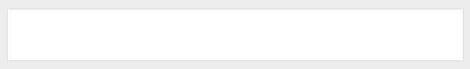
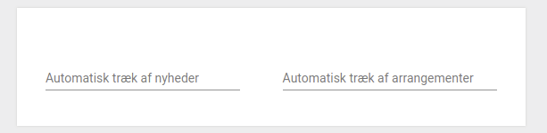
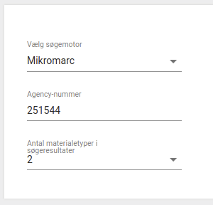
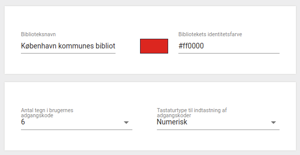
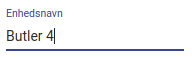
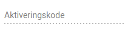
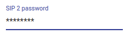
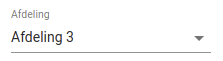
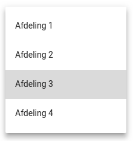
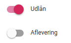

# FireStore structure
This document describes the Firestore structure designed to be the foundation of the Libry Admin platform. The structure consists of:
*  [Languages](##Languages)
*  [Translations](##Translations)
*  [Schemas](##Schemas)
    *  [ContentSchema](###ContentSchema)
    *  [LayoutSchema](###LayoutSchema)
    *  [Clearance](###Clearance)
*  [Groups](##Groups)
*  [Products](##Products)
*  [Customers](##Customers)
*  [Users](##Users)
*  [Roles](##Roles)
*  [Notation](##Notation)

## Languages
The **languages** collection contains the documents that defines a language. The code (reference) of a language is the document ID, and the translation of that language is in the field named "name".

Fx. the language "eng" is represented as:
```
{
  "name": {
    "dan": "Engelsk",
    "eng": "English",
    "nno": "Engelsk",
    "nob": "Engelsk"
  }
}
```

## Translations
The **translations** collection contains the documents that defines a translation for multiple languages. The reference name of a translation is the document ID.

Fx. the translation "butlerName" is represented as:
```
{
  "dan": "Butler",
  "eng": "Butler",
  "nno": "Butler",
  "nob": "Butler"
}
```

# **TODO: THERE ARE MISSING A LOT OF TRANSLATIONS**

## Schemas
The **schemas** collection contains the documents that defines each schema. The schema reference name is the document ID.

A schema is built as:
```
{
  "contentSchema": { ... },
  "layoutSchema": { ... }
  "clearance": { ... }
}
```

### ContentSchema

The field **contentSchema** is an object, defined by a small subset of the [json-schema](https://json-schema.org).

The keyword **$ref** is used as reference to another schema found in /schemas/\_\_SCHEMA_REFERENCE_NAME\_\_ in Firestore.

Example: 
```
{
  "contentSchema": {
    "properties": {
      "url: {
        "type": "string"
      },
      "useCookies": {
        "type": "boolean"
      }
    },
    "required": [ "url" ]
  },
  "layoutSchema": { ... },
  "clearance": { ... }
}
```

### LayoutSchema

The field **layoutSchema** is an object, that defines how to visually represent the data in the schema.

For now layoutSchema has two fields - i.e., **properties** and **order**.

**Properties** describe how each property from contentSchema should be presented to the user, and **order** dictates the order they should appear in.

Example:
```
{
  "contentSchema": { ... },
  "layoutSchema": {
    "order": [ "url", "useCookies" ],
    "properties": {
      "url": {
        "field": "input",
        "translation": "TRANSLATION_ID" // Der skal være en forklaring af at TRANSLATION_ID korresponderer til fx "butlerName" under "Translation"
      },
      "useCookies": {
        "field": "checkbox",
        "translation": "TRANSLATION_ID"
      }
    }
  },
  "clearance": { ... }
}
```

The above example describes a simple layoutSchema where a text input field for url and a checkbox for disabling or enabling the use of cookies are required. The **order** specifies that the text input for the url is supposed to be positioned first, and the useCookies checkbox second. 

Known order types.

| Type | Description | Look |
|------|-------------|------|
| h3 | Just a headline |  |
| section | A box in which to place the specefied fields, checkboxes and other properties described in the layoutSchema |  |
| horizontal | Each element should be placed to the right of previous element |  |
| vertical | Each element should placed beneath the previous element |  |

Here is an example of how to use order (we have to ignore properties in this example).
```
{
  "clearance": { ... },
  "contentSchema": { ... },
  "layoutSchema": {
    "order": [
      {
        "type": "section",
        "order": [
          {
            "type": "horizontal",
            "order": [ "libraryName", "libraryColor" ]
          }
        ]
      },
      {
        "type": "section",
        "order": [
          {
            "type": "horizontal",
            "order": [ "nofCharacters", "numericalOrFull" ]
          }
        ]
      }
    ],
    properties: { ... }
  }
}
```
This example should look something like:




View of known field types. 

| Type | Look |
|------|------|
| input |  |
| readonly |  |
| password |  |
| selector, selector_schema |   |
| toggle, list_of_toggle |  |


The field type **selector** can either get it's items from the field **items** or from **dbItems** (a database path).

**items**:
```
{
  "field": "selector",
  "items": [
    {
      "value": "VALUE",
      "translation": "TRANSLATION_ID"
    },
    ...
  ],
  "translation": "TRANSLATION_ID"
}
```

**dbItems**
```
{
  "field": "selector",
  "dbItems": {
    "dbPath": "DB_PATH",
    "value": "document_id", // For now only value can only be "document_id"
    "translationField": "DOCUMENT_FIELD_TO_USE_FOR_TRANSLATION"
  },
  "translation": "TRANSLATION_ID"
}
```

The field type **selector_schema** can (for now) only take **items**, and they are structured as
```
{
  "field": "selector_schema",
  "items": [
    {
      "id": "ID",
      "schema": "SCHEMA",
      "translation": "TRANSLATION_ID"
    },
    ...
  ],
  "translation": "TRANSLATION_ID"
}
```
When a schema are selected, it must be displayed (generated).


### Clearance

The field **clearance** is an object, that defines which roles have clearance to read or write to the inputs of the schema.

Example:
```
{
  "contentSchema": { ... },
  "layoutSchema": { ... },
  "clearance": { 
    read: "ROLE_ID",
    write: "ROLE_ID"
   }
}
```

The ROLE_ID refers to the ID of the specific role that is allowed to read or write. The ID corresponds to the role found in the **roles** collection. A user will have a specific role assigned as a reference to the **roles** collection.

## Groups
The **groups** collection contains the documents that define each group. The group reference name is the document ID.

All customers have to be in a group, and the group defines which schemas and products are accessible for the customers in the group.

Example:
```
{
  "defaultLanguage": "LANGUAGE_CODE",
  "name": {
    "translation": "TRANSLATION_ID"
  },
  "schemas": [
    "SCHEMA_NAME",
    "SCHEMA_NAME",
    ...
  ],
  "products": [
    "PRODUCT_NAME",
    "PRODUCT_NAME",
    ...
  ]
```

Furthermore, a group can also contain the collection **globalSettings** and **products**.

The collection **globalSettings** contains the default global settings for each customer in the group.

The collection **products** contains the default settings for the products, for the customers in the group.

## Products
The **products** collection contains the documents that define each product. The product reference name is the document ID.

A product contains a field with the production name and a field enabled to tell if the product are enabled.

Example:
```
{
  "enabled": boolean,
  "name": {
    "translation": "TRANSLATION_ID"
  }
}
```

Furthermore, a product can also contain the collection **schema**.

The collection **schema** contains the default schema settings for the product.


## Customers
The **customers** collection contains a document for each customer. The customer reference name is the document ID.

A customer contains a field with the customer name, a field enabled to tell if the customer is enabled and a field to describe which group the customer belongs to.

Example:
```
{
  "enabled": boolean,
  "group": "GROUP_CODE",
  "name": {
    "translation": "TRANSLATION_ID"
  }
}
```

Furthermore, a group can also contain the collections **globalSettings**, **products** and **branches**.

The collection **globalSettings** contains the default global settings for the customer.

The collection **products** contains the customer settings for the products.

The collection **branches** contains the settings for each library under the customer.


## Users
The **users** collection contains a document for each user. The required information for a user includes **name**, **email**, **role** and **customerId**.

Example:
```
{
  "name": string,
  "email": string,
  "role": string,
  "customerId": "CUSTOMER_ID"
}
```

The **name** is the specified name of the user.

The **email** is the specified email of the user.

The **role** describes the specified role of the user. This information is used to determine whether the user has the right to read or write information according to the specific schema. Every schema must contain a read/write property specifying which roles have the rights to do so. In firestore rules, the rules for what a role can read and write needs to be written as well. 

The **customerId** decribes the specified customer of the user. Any user will be assigned a customer when invited to the platform. 


## Roles
The **roles** collection contains a document for each role. The role reference name is the document ID.

A role contains a **name**, which is an object containing the translation for the role.
Example:
```
{
  "name": {
    translation: "TRANSLATION_ID"
  }
}
```

## Notation

**\_\_CUSTOMER_REFERENCE_NAME\_\_** The customer reference name is the document ID of a customer (see [Customers](##Customers)).

**\_\_CUSTOMER_REF\_\_**=/customers/\_\_CUSTOMER_REFERENCE_NAME\_\_ For reference the active customer we have.

**\_\_CUSTOMER_GS_REF\_\_**=\_\_CUSTOMER_REF\_\_/globalSettings For reference the active customer we have.

**\_\_PRODUCT_REF\_\_**=\_\_CUSTOMER_REF\_\_/products For a product references for the active customer.

**\_\_SCHEMA_REFERENCE_NAME\_\_** The schema reference name is the document ID of the schema (see [Schemas](##Schemas)).

